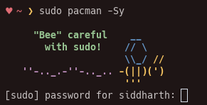
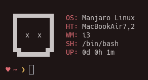
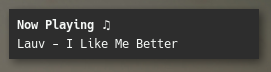

<h1 align="center">dots ♥ ~/</h1>


---

## Explaination
- **.Xmodmap** <br>This file lets me have natural scrolling on MacBookAir.

- **.i3status.conf** <br>I use polybar but have configuration for the i3bar incase I want to switch back


- **.bashrc** <br> Contains my config for the bash shell. It also contains some aliases which I find usefull

- **~/script/term.py** <br> Is a very usefull script. I have a keyboard shortcut (```mod+enter```) which runs this script. What this script does is that if the currect workspace is empty, then it will open my terminal which ```kitty``` as floating enabled. If there is a window in the current workspace, then the terminal will open like other windows

- **~/script/ranger.py** <br> This script is very similar to ```term.py```, whicih is mentioned above. But instead of having a blank terminal, it opens ```ranger```, which is my main file browser. This script is binded to ```mod+Shift+enter```.

- **~/script/sudoer_lecture.py** <br> Just nice message when you do anything with sudo. To make it run properly, but this
into your ```.bashrc```. 
  ```bash
  alias sudo="python3 ~/scripts/sudoer_lecture.py && sudo"
  ```

  

- **~/script/sysinfo.sh** <br> A minimal alternative to neofetch I guess
  
  

- **~/.config/rofi/scripts/picker.sh** <br> A rofi emoji picker. It is binded to ```mod+Shift+d``` 

  


- **.ncmpcpp** <br> There are a few conficurations for it. I like all of them and switch between them from time to time 

- **~/.config/**
  - **audacious** <br> Just a simple config to make audacious minimal
  
  - **dunst** <br> Some configuration for my notification deamon that I took from somewhere
  
    
    
  - **gtk-3.0** <br> Here you will find ```gtk.css``` which adds paddings for vte-based terminal and ```settings.ini``` which setts my gtk theme and the icons
  
  - **i3** <br> Basic configuration for the ```i3-gaps``` window manager. The only keybinding that might be needed to be noted is that ```mod+x``` launches ```betterlockscreen```
  
  - **polybar** <br> In this folder you will find a file called ```config``` which has some neat configurartion and file called ```launch.sh``` which is script which used to start polybar

  
  - **ranger** <br> Minimal configuration for my cli file manager which also lets view the images in the terminal. But there is a small bug which makes the images sometimes not render properly
  
  - **rofi** <br> A random color scheme which does not really fit the rest the configs. Its better than plain white which is the deafult I guess
  
  - **termite** <br> My termite terminal emulator configuration. The color scheme is the ocean-next color scheme with but the background color is gotton from pywal-web
  
- **etc/X11/xorg.conf.d** <br> This config allows me to just tap on my trackpad instead of clicking it. For this to work, you will need ```libinput```.

- **.vimrc** <br> Just a simple vimrc. Nothing special her.


# Extra

- **WM:** [i3-gaps](https://github.com/Airblader/i3)

- **Terminal:** kitty

- **Shell:** bash

- **Fonts:** Hack, Font Awesome

- **Color scheme:** [Ocean Next Theme](https://github.com/voronianski/oceanic-next-color-scheme)

- **Theme:** [Arc-Dark](https://github.com/horst3180/Arc-theme)

- **Icons:** [Paper](https://www.snwh.org/paper)

- **Music Player:** ncmpcpp and Audacious for double click music files

- **Text editor:** Sublime Text 3 and VIM

- **File explorer:** ranger and sometimes Thunar

- **Image viewer:** Viewnior

- **Program launcher:** Rofi

- **Wallpaper handler:** feh

