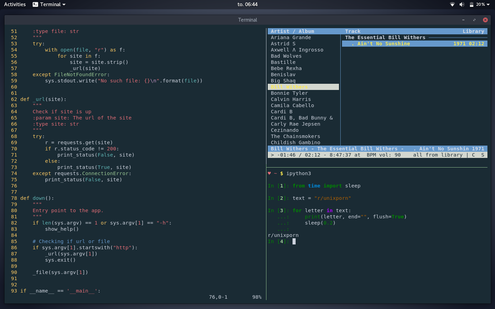

```
                    _   _ _                 _               _       _             
                   | | | | |__  _   _ _ __ | |_ _   _    __| | ___ | |_ ___       
                   | | | | '_ \| | | | '_ \| __| | | |  / _` |/ _ \| __/ __|      
                   | |_| | |_) | |_| | | | | |_| |_| | | (_| | (_) | |_\__ \_ _ _ 
                    \___/|_.__/ \__,_|_| |_|\__|\__,_|  \__,_|\___/ \__|___(_|_|_)

```

## Dark Theme



I always use the dark theme since its better for my eyes

**Theme:** Arc-Dark

**Stuff in the screenshots :** Neofetch, iPython3, cmus, vim

## Light Theme

But I just made a light theme for fun :)

**Theme:** Arc

**Stuff in the screenshots :** feh, Neofetch, 2048.c

---

# Extra

Editor: Vim

Terminal: [tmux](https://github.com/tmux/tmux)

Colorscheme: [Oceanic Next](https://github.com/voronianski/oceanic-next-color-scheme)

Shell: bash

Icons: Paper
```
 _________
< THE END >
 ---------
        \   ^__^
         \  (oo)\_______
            (__)\       )\/\
                ||----w |
                ||     ||
```
